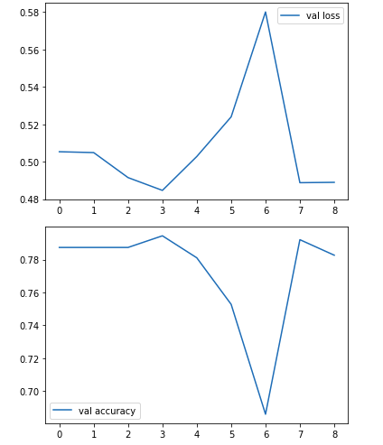
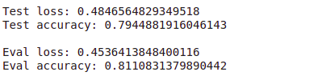

# BEE CLASSIFICATION USING CNN

In this project, a CNN classifier is build to classify a honey bee and a bumble bee. A CNN is implemented using Keras Sequential API and evaluated on test dataset using Accuracy as an evaluation metric.
Implementation and Specifications:

Libraries used: ⦁ skimage ⦁ Numpy ⦁ Matplotlib ⦁ sklearn

Framework used: ⦁ Keras ⦁ Python 3.7

Dataset: Honey Bee and Bumble Bee

Training Samples : 1904 ⦁ Testing Samples : 794 ⦁ Validation Samples: 1270

Results: Evaluation Metric : Accuracy on test data: 81 %

Below are the loss and accuracy on validation and test dataset. Here test loss = validation and eval loss = test

Conclusion: The results for this task using CNN Classifier shows good performance in terms of accuracy with 81% on test dataset. This can be improved further and optimized using large training dataset. Additionally, the training images can be pre-processed using image processing libraries and packages which will further enhance the testing results.
